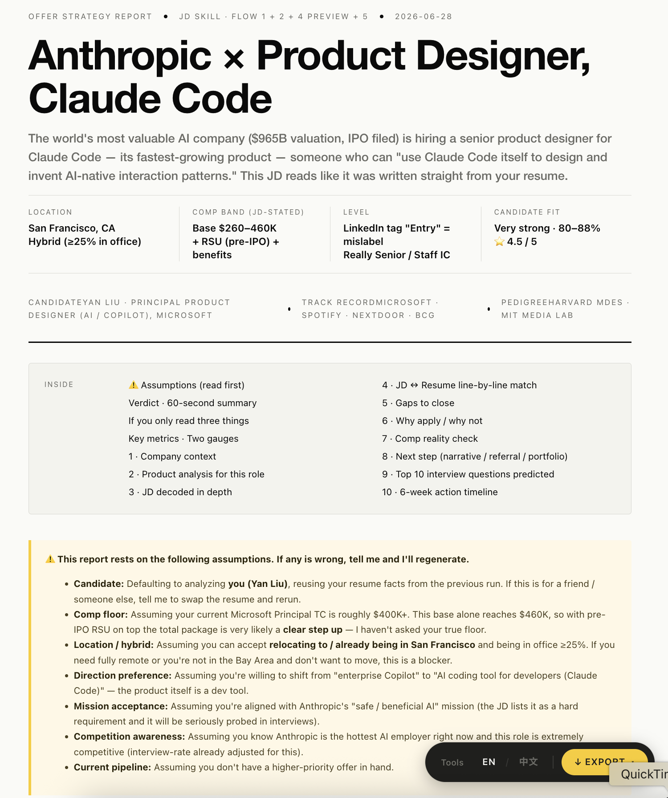
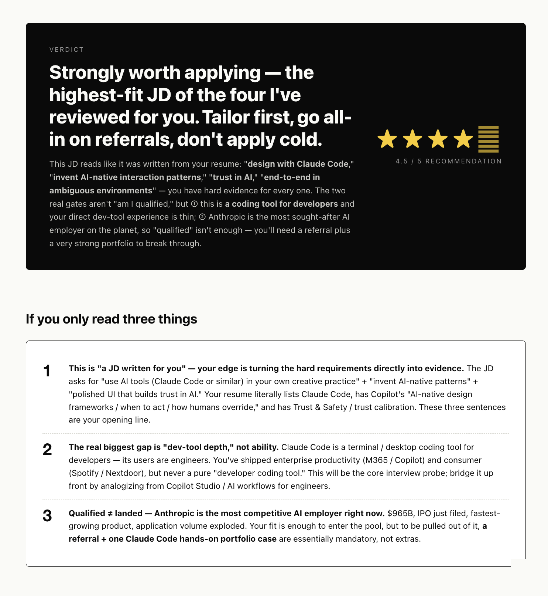
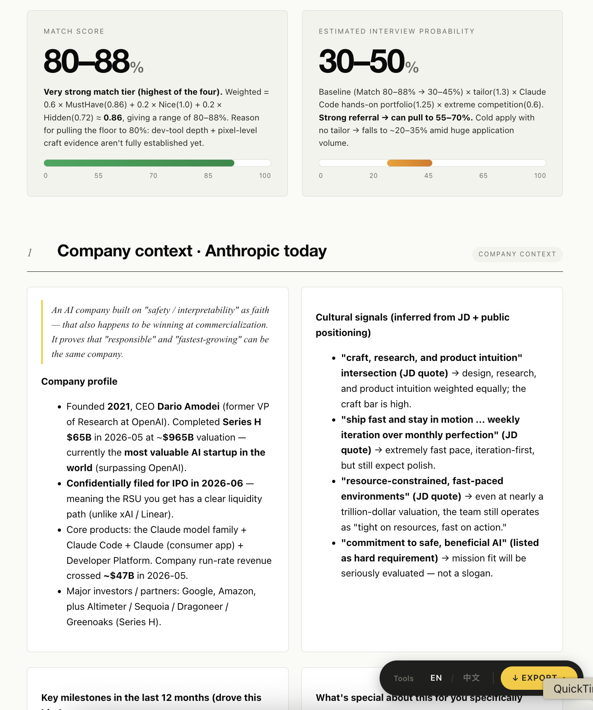
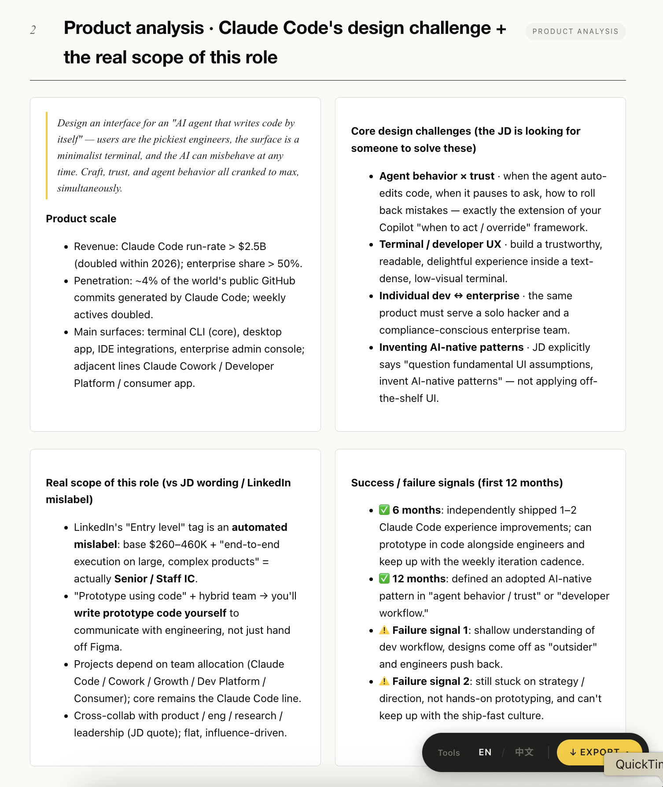
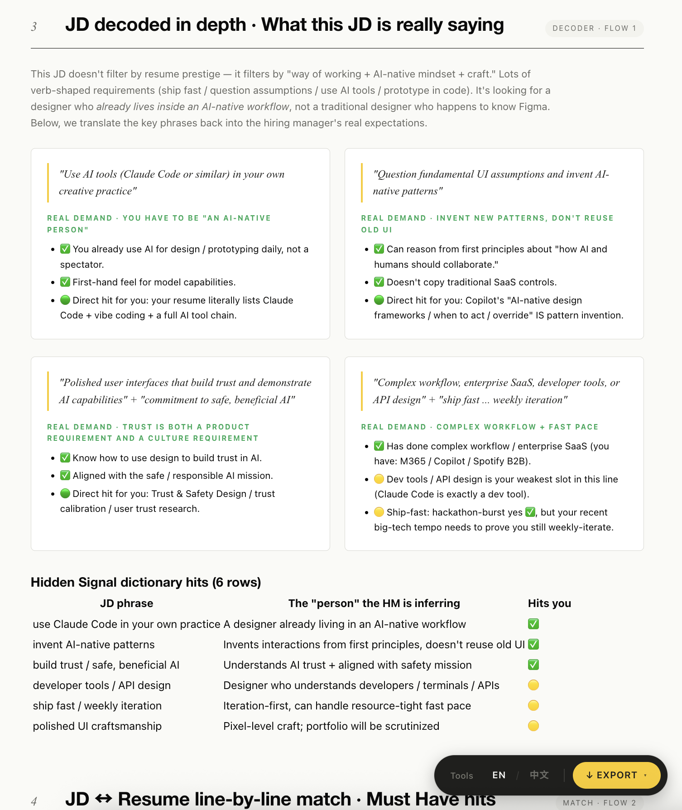
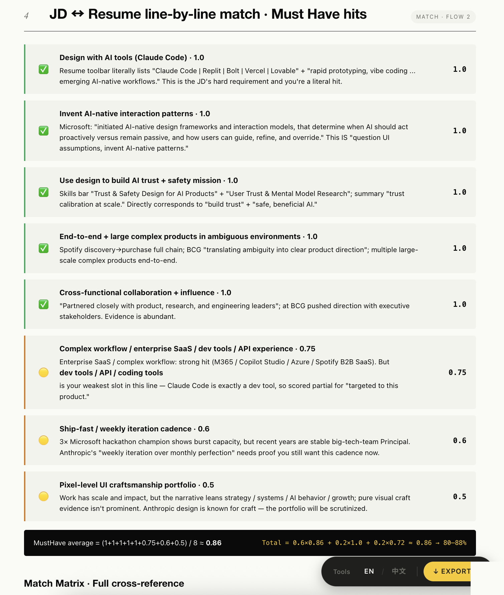
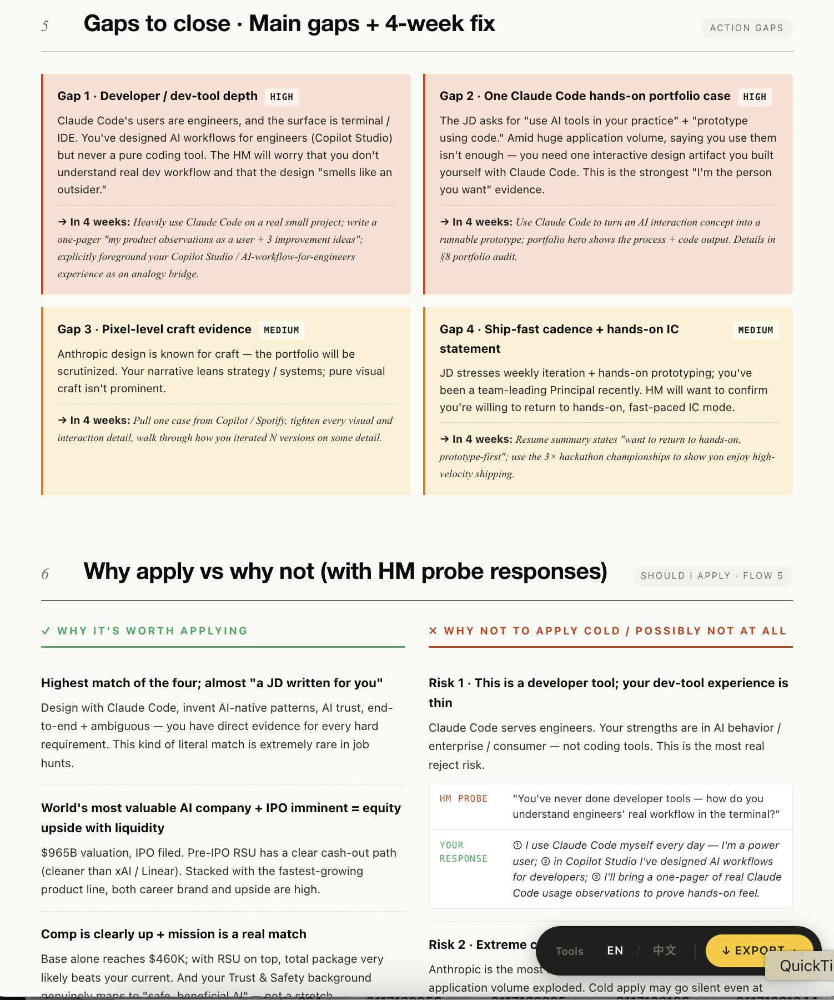
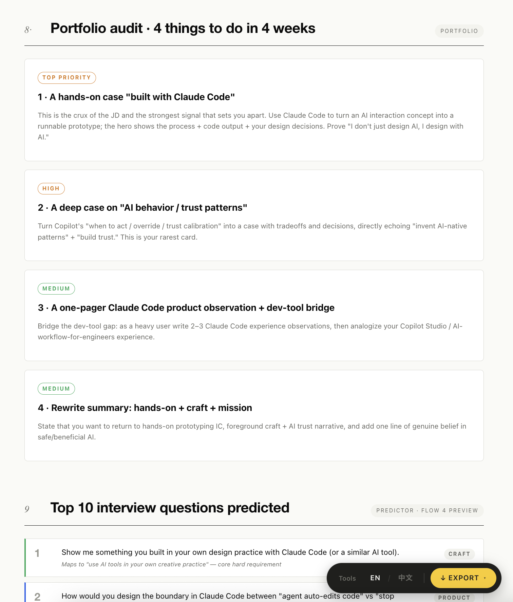
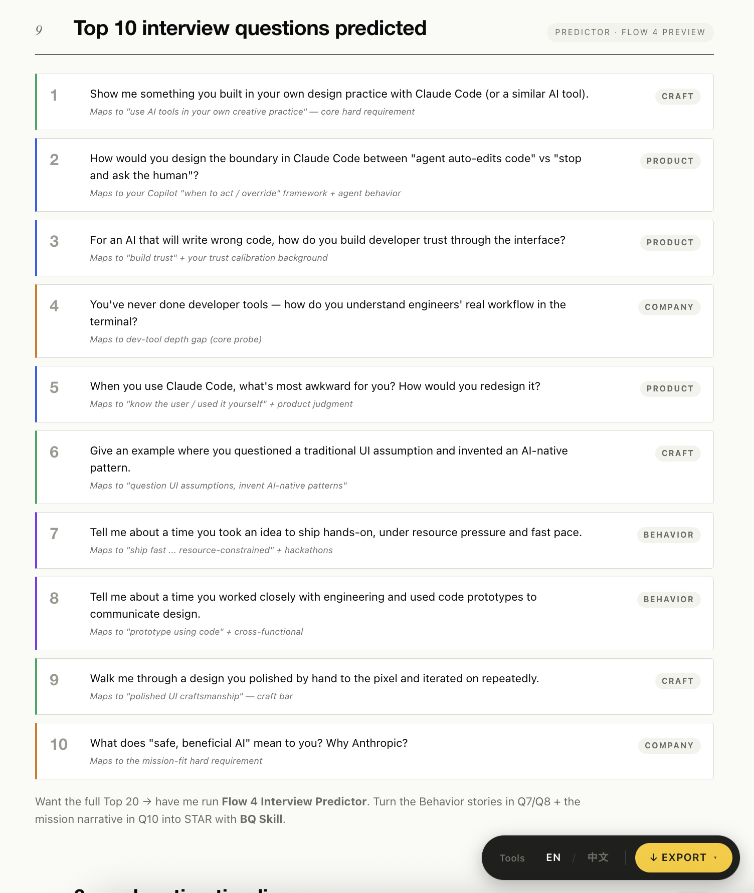

<div align="center">

[中文](./README.zh.md) · **English**

# 🧰 Offer Toolkit

---

**Three job-hunt tools in one agent skill pack — JD · Resume · BQ.**

[](./LICENSE)
[]()
[]()
[](https://github.com/yanliudesign/offer-toolkit-skill/stargazers)

[](https://claude.ai/code)
[]()
[]()
[]()
[]()

</div>

Three job-hunting tools bundled as an agent skill pack. Use the whole thing, or just the piece you need — each sub-folder works on its own.

```
See a job you want → job-description-skill   decode the JD, get an Offer Strategy report
       ↓ decide to apply
                     resume-skill            tailor & polish, 11 print-ready templates
       ↓ get the interview
                     bq-skill                mine stories, build a story bank, prep BQs
```

## Screenshots



<sub>The Offer Strategy Report generated by <code>job-description-skill</code>, opened in-browser — verdict, assumptions, TL;DR, and the built-in EN / 中文 toggle in the bottom-right toolbar.</sub>

<table>
<tr>
<td width="33%"></td>
<td width="33%"></td>
<td width="33%"></td>
</tr>
<tr>
<td></td>
<td></td>
<td></td>
</tr>
<tr>
<td></td>
<td></td>
<td></td>
</tr>
</table>

<sub>Full galleries: <a href="docs/en/">English</a> · <a href="docs/zh/">中文</a> — sub-skill galleries live under each sub-folder's <code>docs/</code> or <code>assets/</code>.</sub>

## What's inside

| Sub-skill | What it does |
|---|---|
| **[job-description-skill](job-description-skill/)** | Give it a JD and your resume. You get back an HTML report telling you: whether this job is worth applying to, how well you match it, where the gaps are, what you'll probably be asked in interviews, whether the salary is reasonable, and what to do over the next six weeks. |
| **[resume-skill](resume-skill/)** | Polishes an existing resume, pulls one in from LinkedIn, or builds one from scratch by chatting with you. The content then flows into **11 print-ready templates** (Classic-ATS, Ledger, Tech Compact, Modern Sidebar, Pillar, Elegant Serif, Atelier, Timeline, Swiss, Executive, Color-block). Each render gives you two files: one that prints straight to PDF, and one you can click on in the browser to edit. |
| **[bq-skill](bq-skill/)** | Instead of handing you canned answers, it helps you dig your real past experiences out and organize them into a story bank you can reuse. It asks about your experience step by step, uses STAR/CAR to shape each story, tags them ("took ownership", "handled ambiguity", etc.), and saves them in English and Chinese — so next time you get a different behavioral question, the same story still works. It can also read a JD, predict the 20 questions that company is likely to ask, and walk you through prep for each one. |

## Three rules the sub-skills share

1. **Never fabricate.** Every experience, number, and title comes from what the user actually said. Sharpen weak content, don't invent it. Verify numbers.
2. **One question at a time.** Building a resume, mining a story, prepping a BQ — these are conversations, not questionnaires.
3. **Structure first, render second.** Get the content into a standard shape and confirm it before generating anything.

## Install

Drop the whole `offer-toolkit-skill/` folder into your skills directory (e.g. `~/.claude/skills/` or VS Code's prompts folder). All three sub-skills get picked up.

Only want one? Copy just that sub-folder — each one is self-contained.

## Trigger phrases

| You say | Runs |
|---|---|
| Paste a JD / *"should I apply to this?"* / *"help me with this job"* | job-description-skill |
| *"Beautify my resume"* / *"build me one from scratch"* / upload PDF / paste LinkedIn | resume-skill |
| *"Prep me for behavioral interviews"* / *"tell me about a time…"* / *"mine a story"* | bq-skill |
| *"Help me find a job"* / hand over JD + resume at once | Top-level [SKILL.md](SKILL.md) routes you to the right one |

## Layout

```
offer-toolkit-skill/
├── SKILL.md                        # Router: intent → sub-skill
├── README.md / README.zh.md
├── LICENSE                         # MIT
├── job-description-skill/          # ① JD decoder + Offer Strategy report
├── resume-skill/                   # ② Resume builder + 11 templates
└── bq-skill/                       # ③ Behavioral interview / story bank
```

Each sub-folder has its own `SKILL.md`, README, prompts, frameworks, and templates.

## Standalone repos

These three also live as separate repos and get maintained there:

- [job-description-skill](https://github.com/yanliudesign/job-description-skill)
- [resume-builder-skill](https://github.com/yanliudesign/resume-builder-skill)
- [Behavior-question-skill](https://github.com/yanliudesign/Behavior-question-skill)

This bundle just puts them together with a top-level router.

## License

MIT — fork it, remix it, ship your own version.

Created by [Dreameryanyan](https://www.linkedin.com/in/yanliudesign/) ·
[LinkedIn](https://www.linkedin.com/in/yanliudesign/) ·
[X](https://x.com/yanliudreamer) ·
[Xiaohongshu](https://www.xiaohongshu.com/notification)
