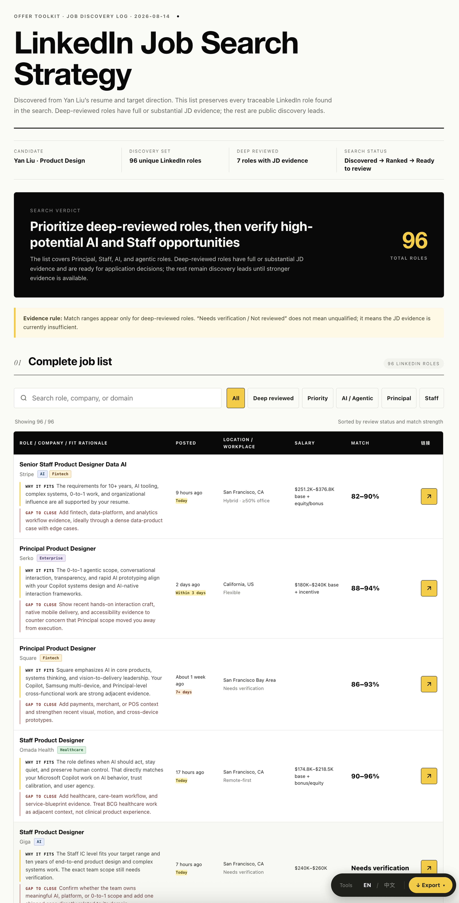
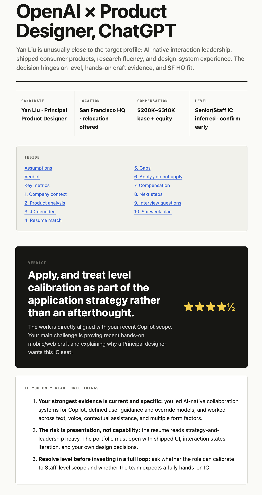
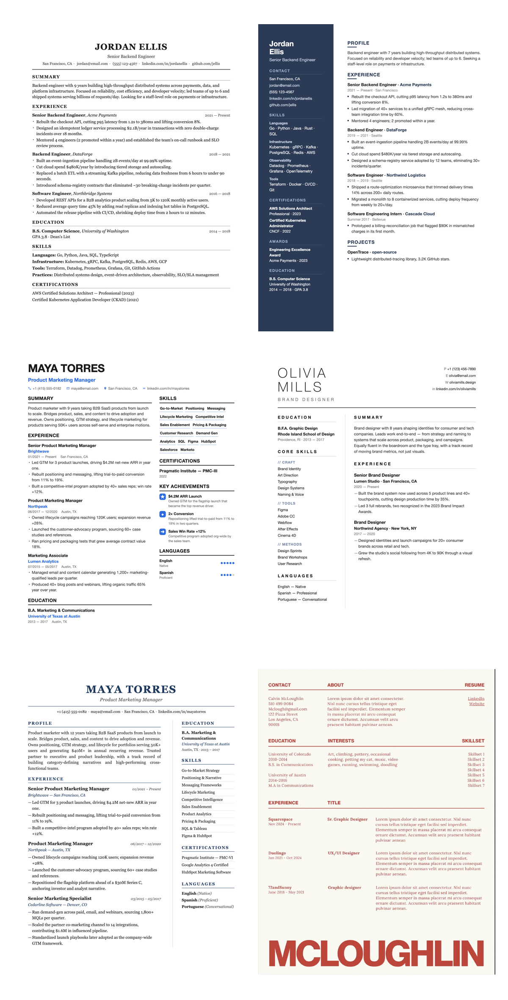
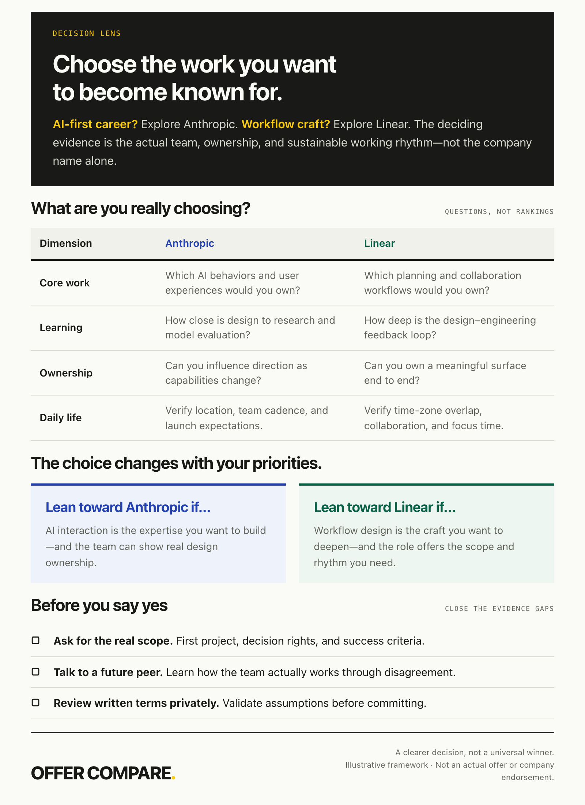

<div align="center">

[中文](./README.zh.md) · **English**

# 🧰 Offer Toolkit

---

**Six job-hunt tools in one agent skill pack — Search · JD · Resume · BQ · Compare · Negotiate.**

[](./LICENSE)
[]()
[]()
[](https://github.com/yanliudesign/offer-toolkit-skill/stargazers)
[]()

[](https://claude.ai/code)
[]()
[]()
[]()
[]()

</div>

Six job-hunting tools bundled as an agent skill pack. Use the whole thing, or just the piece you need — each sub-folder works on its own.

```
0  Discover opportunities → job-hunt-skill           Build a deduplicated, searchable HTML job list.
1  See a job you want    →  job-description-skill    Decode the JD, get an Offer Strategy report.
2  Decide to apply       →  resume-skill             Tailor & polish. 12 print-ready templates.
3  Land the interview    →  bq-skill                 Mine stories, build a story bank, prep BQs.
4  Compare offers        →  offer-compare-skill      Compare TC, growth, risk, and get a clear recommendation.
5  Negotiate the package →  salary-negotiation-skill Diagnose leverage, generate scripts, and set stop-lines.
```

## What's inside

<table>
<thead><tr><th width="30%">Sub-skill</th><th>What it does</th></tr></thead>
<tbody>
<tr><td><strong><a href="job-hunt-skill/">job&#8209;hunt&#8209;skill</a></strong></td><td>Give it a resume, target direction, seed JD, or existing job links. It searches public sources, deduplicates candidates, separates verified facts from inference, and generates a searchable HTML job list. It discovers and analyzes; it never applies for you.</td></tr>
<tr><td><strong><a href="job-description-skill/">job&#8209;description&#8209;skill</a></strong></td><td>Give it a JD and your resume. You get back an HTML report telling you: whether this job is worth applying to, how well you match it, where the gaps are, what you'll probably be asked in interviews, whether the salary is reasonable, and what to do over the next six weeks.</td></tr>
<tr><td><strong><a href="resume-skill/">resume&#8209;skill</a></strong></td><td>Polishes an existing resume, pulls one in from LinkedIn, or builds one from scratch by chatting with you. The content then flows into <strong>12 print-ready templates</strong> (Classic-ATS, Ledger, Modern Sidebar, Pillar, Elegant Serif, Atelier, Timeline, Swiss, Executive, Editorial Banner, Photo Corporate, Photo Minimal). Each render gives you two files: one that prints straight to PDF, and one you can click on in the browser to edit.</td></tr>
<tr><td><strong><a href="bq-skill/">bq&#8209;skill</a></strong></td><td>Instead of handing you canned answers, it helps you dig your real past experiences out and organize them into a story bank you can reuse. It asks about your experience step by step, uses STAR/CAR to shape each story, tags them ("took ownership", "handled ambiguity", etc.), and saves them in English and Chinese — so next time you get a different behavioral question, the same story still works. It can also read a JD, predict the 20 questions that company is likely to ask, and walk you through prep for each one.</td></tr>
<tr><td><strong><a href="offer-compare-skill/">offer&#8209;compare&#8209;skill</a></strong></td><td>Compares two or more offers across four-year TC, growth, AI exposure, company and team risk, promotion, lifestyle, resume value, and future mobility. It produces an HTML Offer Decision Report with an explicit recommendation.</td></tr>
<tr><td><strong><a href="salary-negotiation-skill/">salary&#8209;negotiation&#8209;skill</a></strong></td><td>Diagnoses Base, RSU, Sign-on, and Bonus leverage; builds a negotiation strategy; writes ready-to-use phone and email scripts; simulates recruiter pushback; and defines clear sign, walk, and stop-lines in an HTML Negotiation Playbook.</td></tr>
</tbody>
</table>

## Examples

<table>
<tr>
<td width="33%" align="center"><h2>01 · JOB DISCOVERY</h2></td>
<td width="34%" align="center"><h2>02 · JD ANALYSIS</h2></td>
<td width="33%" align="center"><h2>03 · RESUME</h2></td>
</tr>
<tr>
<td valign="top"></td>
<td valign="top"></td>
<td valign="top"></td>
</tr>
<tr>
<td valign="top"><sub>Ranked opportunities, evidence labels, and filters.</sub></td>
<td valign="top"><sub>Role fit, gaps, interview predictions, compensation, and action plan.</sub></td>
<td valign="top"><sub>Twelve print-ready layouts with browser editing and PDF export.</sub></td>
</tr>
<tr>
<td align="center"><h2>04 · BQ PREP</h2></td>
<td align="center"><h2>05 · OFFER COMPARE</h2></td>
<td align="center"><h2>06 · NEGOTIATION</h2></td>
</tr>
<tr>
<td valign="top"></td>
<td valign="top"></td>
<td valign="top"></td>
</tr>
<tr>
<td valign="top"><sub>Top 20 questions with STAR templates and editable model answers.</sub></td>
<td valign="top"><sub>Four-year compensation, career upside, risks, and a clear recommendation.</sub></td>
<td valign="top"><sub>Leverage diagnosis, counter strategy, scripts, and decision boundaries.</sub></td>
</tr>
</table>

## Four rules the sub-skills share

1. **Never fabricate.** Every experience, number, and title comes from what the user actually said. Sharpen weak content, don't invent it. Verify numbers.
2. **Ask only what changes the answer.** Follow each child skill's stated one-at-a-time or batched intake cadence; never turn the conversation into a sprawling questionnaire.
3. **Structure first, render second.** Get the content into a standard shape and confirm it before generating anything.
4. **Never apply on the user's behalf.** Search can be automated; submitting forms and sending messages remain user actions.

## Install

Drop the whole `offer-toolkit-skill/` folder into your skills directory (e.g. `~/.claude/skills/` or VS Code's prompts folder). All six sub-skills get picked up.

Only want one? Copy just that sub-folder — each one is self-contained.

> 🔒 **Your generated files stay local.** Reports, resumes, and story banks are written to your machine. Your prompts and attachments are processed according to the data policy of the agent and model provider you use.

### Try it in 30 seconds

Once installed, copy any prompt into your Claude Code / VS Code chat:

```text
Should I apply to this? I'll paste the JD link or full text next.
```

```text
Use this JD and my resume to find matching LinkedIn jobs.
```

```text
Beautify my resume. I'll attach the PDF next.
```

```text
Prep me for behavioral interviews.
```

```text
Compare these two offers and tell me which one to take.
```

```text
Help me negotiate this offer.
```

The router picks the right sub-skill. You get an HTML report / resume / story bank on your desktop, ready to open.

## FAQ

<details>
<summary><strong>Do I need to install all six skills?</strong></summary>

No. Install the whole toolkit for automatic routing across the job-search journey, or copy a single sub-folder if you only need one skill. Every sub-skill is self-contained.
</details>

<details>
<summary><strong>Do I have to use the six skills in order?</strong></summary>

No. The full sequence is useful when you are starting a job search, but you can enter at any stage. Already have an interview? Start with BQ Skill. Already have offers? Go straight to Offer Compare or Salary Negotiation.
</details>

<details>
<summary><strong>Why didn't the skill trigger?</strong></summary>

Make sure the folder still contains its `SKILL.md`, then start a new chat or reload your agent after installation. You can also invoke it explicitly, for example: “Use resume-skill to improve this resume.”
</details>

<details>
<summary><strong>Can I use this with Claude Code, Codex, or VS Code?</strong></summary>

Yes, when the client supports `SKILL.md`-style agent skills or workspace instructions. Installation directories and skill-discovery behavior vary by client, so follow that client's current documentation.
</details>

<details>
<summary><strong>Is it free, and do I need an API key?</strong></summary>

The toolkit itself is open source and does not require a separate API key. You still need access to a compatible AI client, whose subscription, usage fees, and authentication requirements depend on the provider you choose.
</details>

<details>
<summary><strong>Where are generated files saved?</strong></summary>

Most HTML reports default to `~/Desktop/Claude skills/`. Some persistent records, such as story banks and analyzed JDs, live inside the relevant sub-skill folder. The agent should always report the exact output path when it finishes.
</details>

<details>
<summary><strong>Will it apply to jobs or send messages for me?</strong></summary>

No. It can discover and analyze public job listings, but applications, form submissions, recruiter messages, and account actions remain yours.
</details>

## Trigger phrases

| You say | Runs |
|---|---|
| *"Find me a job"* / *"Search LinkedIn for matching roles"* / *"Use job-hunt-skill with my resume"* | job-hunt-skill |
| Paste a JD / *"should I apply to this?"* / *"help me with this job"* | job-description-skill |
| *"Beautify my resume"* / *"build me one from scratch"* / upload PDF / paste LinkedIn | resume-skill |
| *"Prep me for behavioral interviews"* / *"tell me about a time…"* / *"mine a story"* | bq-skill |
| *"Compare these offers"* / *"which offer should I take?"* / *"calculate four-year TC"* | offer-compare-skill |
| *"Help me negotiate"* / *"write a counter offer"* / *"can I ask for more RSU?"* | salary-negotiation-skill |
| *"Help me find a job"* / hand over JD + resume at once | Top-level [SKILL.md](SKILL.md) routes you to the right one |

## Layout

```
offer-toolkit-skill/
├── SKILL.md                        # Router: intent → sub-skill
├── README.md / README.zh.md
├── LICENSE                         # MIT
├── job-hunt-skill/                 # ⓪ Complete searchable job discovery list
├── job-description-skill/          # ① JD decoder + Offer Strategy report
├── resume-skill/                   # ② Resume builder + 12 templates
├── bq-skill/                       # ③ Behavioral interview / story bank
├── offer-compare-skill/            # ④ Multi-offer comparison + decision report
└── salary-negotiation-skill/       # ⑤ Package negotiation + scripts
```

Each sub-folder has its own `SKILL.md`, README, prompts, frameworks, and templates.

## Standalone repos

These six also live as separate repos and get maintained there:

- [job-hunt-skill](https://github.com/yanliudesign/job-hunt-skill)
- [job-description-skill](https://github.com/yanliudesign/job-description-skill)
- [resume-builder-skill](https://github.com/yanliudesign/resume-builder-skill)
- [Behavior-question-skill](https://github.com/yanliudesign/Behavior-question-skill)
- [offer-compare-skill](https://github.com/yanliudesign/offer-compare-skill)
- [salary-negotiation](https://github.com/yanliudesign/salary-negotiation)

This bundle just puts them together with a top-level router.

## License

MIT — fork it, remix it, ship your own version.

Created by [Dreameryanyan](https://www.linkedin.com/in/yanliudesign/) ·
[LinkedIn](https://www.linkedin.com/in/yanliudesign/) ·
[X](https://x.com/yanliudreamer) ·
[Xiaohongshu](https://www.xiaohongshu.com/notification)


## 相关工具
- [简历大师 ResumeMaster](https://markmiller1.github.io/resume-master/) — 永久免费的纯前端在线简历生成器（数据本地保存、ATS 检测、64 个免费页面）