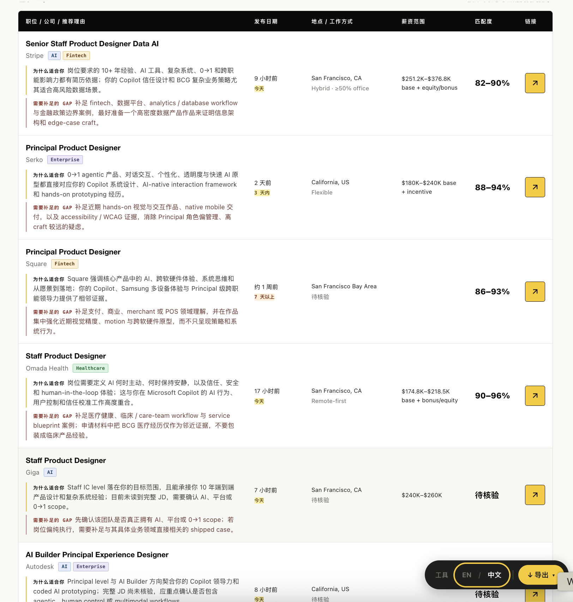
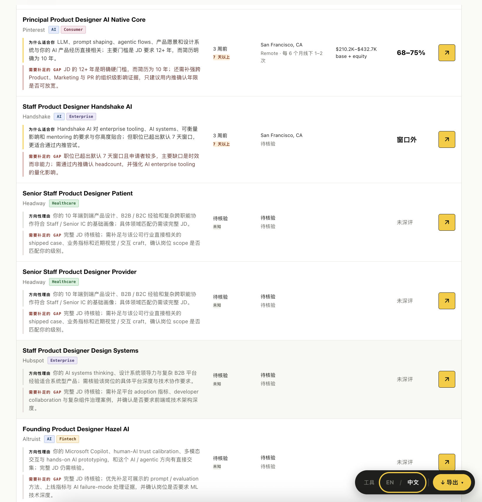
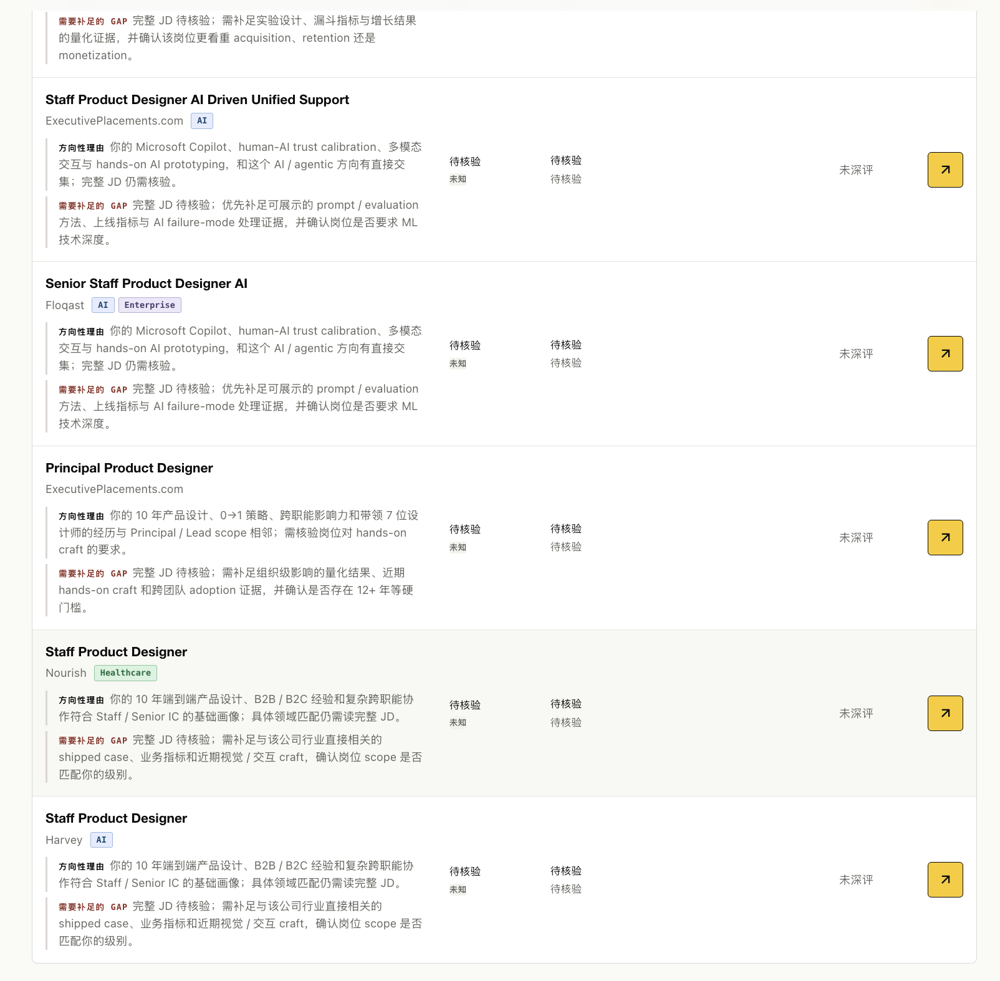
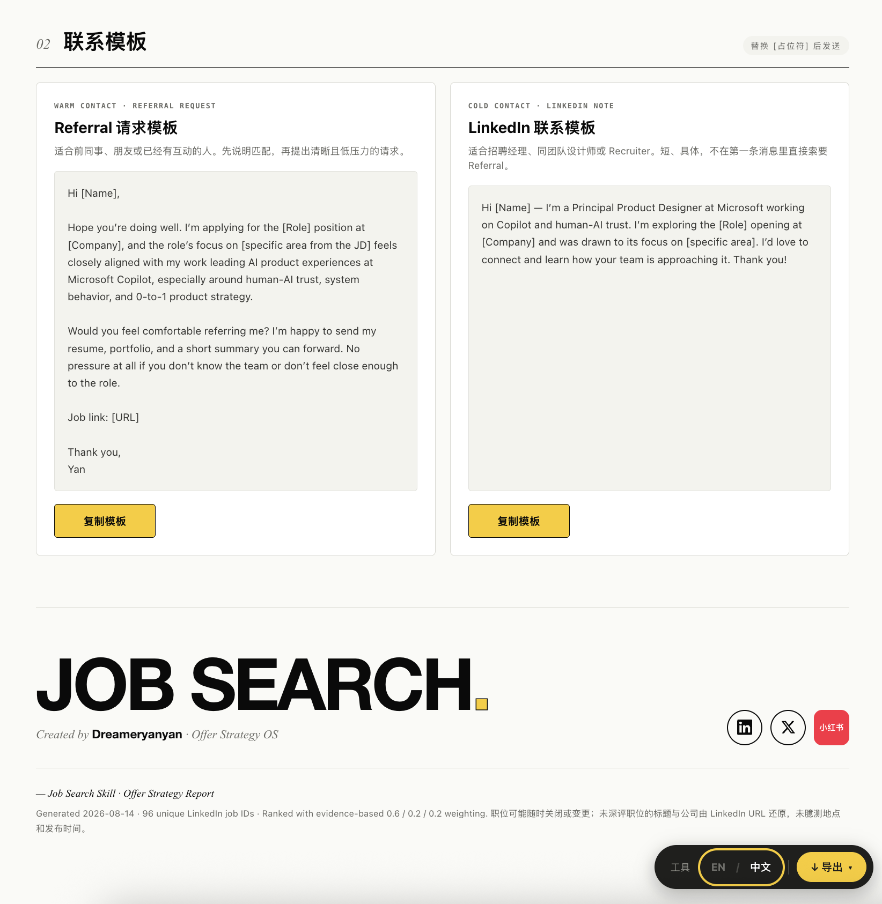
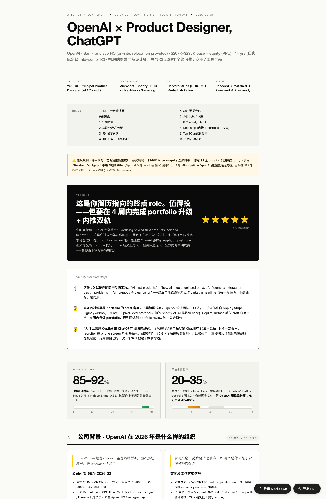
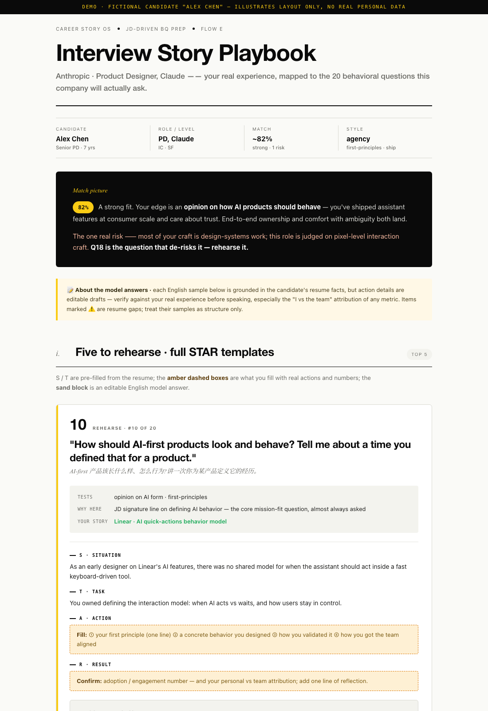

<div align="center">

**中文** · [English](./README.md)

# 🧰 Offer Toolkit

---

**六个求职工具打包成一个 agent skill 包 — Search · JD · Resume · BQ · Compare · Negotiate。**

[](./LICENSE)
[]()
[]()
[](https://github.com/yanliudesign/offer-toolkit-skill/stargazers)

[](https://claude.ai/code)
[]()
[]()
[]()
[]()

</div>

六个求职工具打包成一个 agent skill 包。可以整包用，也可以只挑其中一个——每个子目录都能独立跑。

```
0  还在找机会      →  job-hunt-skill           批量发现、去重、生成可搜索清单
1  看到心动岗位    →  job-description-skill    解码 JD、出一份 Offer Strategy 报告
2  决定投          →  resume-skill             改简历、11 套打印级模板
3  拿到面试        →  bq-skill                 挖故事、建故事库、准备 BQ
4  拿到多个 offer  →  offer-compare-skill      对比 TC、成长与风险，给明确推荐
5  准备签 offer    →  salary-negotiation-skill 诊断杠杆、生成话术、明确停止线
```

## 里面有什么

| 子 skill | 做什么 |
|---|---|
| **[job-hunt-skill](job-hunt-skill/)** | 给一份简历、目标方向、种子 JD 或已有职位链接，自动搜索公开来源、去重并区分事实与推断，生成可搜索筛选的 HTML 职位清单。只发现和分析，不自动投递。 |
| **[job-description-skill](job-description-skill/)** | 贴一份 JD 和你的简历，给你一份 HTML 报告，告诉你：这岗位到底该不该投、你和它多匹配、差在哪里、面试大概会问什么、薪资合不合理、接下来 6 周该做什么。 |
| **[resume-skill](resume-skill/)** | 帮你把现有简历改好看，或者从 LinkedIn 导入，再或者聊着聊着帮你从零写一份。给你 **11 套打印级模板**（Classic-ATS、Ledger、Tech Compact、Modern Sidebar、Pillar、Elegant Serif、Atelier、Timeline、Swiss、Executive、Color-block）。每次同时给你两份文件：一份直接可以打印成 PDF，一份在浏览器里点字就能改。 |
| **[bq-skill](bq-skill/)** | 不是给你现成答案，而是帮你把过去真实做过的事情挖出来、整理成一个可以反复用的故事库。它会一步步追问你的经历，帮你用 STAR/CAR 理清思路，打上“拿主意”“択历就难”这类标签，中英文各存一份，下次碰上不同行为面试题也能用同一个故事。还能对着一份 JD，预测这家公司会问的 20 道题，帮你逐题准备。 |
| **[offer-compare-skill](offer-compare-skill/)** | 对比两份或多份 offer 的 4 年 TC、成长、AI 敞口、公司与团队风险、晋升、生活方式、简历价值和未来跳槽便利，生成 HTML Offer Decision Report，并给出明确推荐。 |
| **[salary-negotiation-skill](salary-negotiation-skill/)** | 诊断 Base、RSU、Sign-on、Bonus 的谈判空间，制定策略，生成可直接使用的中英文电话/邮件话术，模拟招聘官 pushback，并在 HTML Negotiation Playbook 中写清签、走和停止线。 |

## 示例

### 岗位发现


<sub>自动生成的 job-hunt-skill 报告，包含岗位排序、证据标签和快速筛选。</sub>

<table>
<tr>
<td width="50%"></td>
<td width="50%"></td>
</tr>
<tr>
<td></td>
<td></td>
</tr>
</table>

### JD 解码



<sub>自动生成的 Offer Strategy 报告，包含岗位匹配度、能力差距、面试预测、薪资分析和六周行动计划。</sub>

### 行为面试准备



<sub>根据 JD 反推的 Top 20 面试题，包含 STAR 模板和可编辑的示例答案；演示使用虚构候选人资料。</sub>

## 四条共用规则

1. **不杜撰。** 所有经历、职责、数字都来自用户真实说过的内容。可以帮改弱表达，但绝不编公司、职位、成果、量化数字。数字都要向用户求证。
2. **只问会改变结论的信息。** 遵循各子 skill 规定的逐题或批量提问节奏，不把对话变成长问卷。
3. **先结构化再产出。** 先落到标准数据模型，确认无误再渲染 HTML 或生成答案。
4. **不替用户投递。** 岗位搜索可以自动化，Apply、填写表单和发送消息必须由用户本人完成。

## 安装

把整个 `offer-toolkit-skill/` 目录放进你的 skill 目录（例如 `~/.claude/skills/` 或 VS Code 的 prompts 目录）。六个子 skill 会一起被发现。

只想装一个？把对应子目录（如 `resume-skill/`）单独复制过去，每个都自包含。

> 🔒 **你的数据不出本机。**JD、简历、职业故事都只在当下被模型读一遍，结果写回你本地磁盘——不上传服务器、不参与训练。

### 30 秒上手

装完以后把这些话直接贴进你的 Claude Code / VS Code 对话框：

- *「这个岗位我该不该投？」* + 贴一份 JD 链接或全文
- *「根据这份 JD 和我的简历，在 LinkedIn 找适合我的岗位」*
- *「帮我美化一下简历」* + 拖一份 PDF 进来
- *「帮我准备 behavioral interview」*
- *「帮我比较这两份 offer，明确告诉我选哪份」*
- *「帮我谈一下这份 offer」*

顶层 router 会自动路由到对应子 skill，报告 / 简历 / 故事库直接生成在你桌面上，双击就能打开。

## 触发词

| 用户说 | 走哪个 |
|---|---|
| "帮我找工作" / "在 LinkedIn 搜适合我的岗位" / "根据简历做职位清单" | job-hunt-skill |
| 贴 JD / "这个岗位该不该投" / "帮我看看这份工作" | job-description-skill |
| "帮我美化简历" / "帮我从零做一份" / 上传 PDF / 贴 LinkedIn | resume-skill |
| "帮我准备 behavioral 面试" / "Tell me about a time…" / "帮我挖一个故事" | bq-skill |
| "帮我比较两份 offer" / "A 还是 B" / "算一下 4 年 TC" | offer-compare-skill |
| "帮我谈薪" / "怎么 counter" / "能不能多要 RSU" | salary-negotiation-skill |
| 只说“求职”但意图不明确 | 顶层 [SKILL.md](SKILL.md) 追问当前所处阶段 |

## 目录结构

```
offer-toolkit-skill/
├── SKILL.md                        # 路由：意图 → 子 skill
├── README.md / README.zh.md
├── LICENSE                         # MIT
├── job-hunt-skill/                 # ⓪ 完整可搜索职位清单
├── job-description-skill/          # ① JD 解码 + Offer Strategy 报告
├── resume-skill/                   # ② 简历生成 + 11 套模板
├── bq-skill/                       # ③ 行为面试 / 故事库
├── offer-compare-skill/            # ④ 多 Offer 对比 + 决策报告
└── salary-negotiation-skill/       # ⑤ 薪资谈判 + 可执行话术
```

每个子目录里都有各自的 `SKILL.md`、README、prompts、frameworks、templates。

## 独立仓库

这六个 skill 也各自有独立仓库，独立维护：

- [job-hunt-skill](https://github.com/yanliudesign/job-hunt-skill)
- [job-description-skill](https://github.com/yanliudesign/job-description-skill)
- [resume-builder-skill](https://github.com/yanliudesign/resume-builder-skill)
- [Behavior-question-skill](https://github.com/yanliudesign/Behavior-question-skill)
- [offer-compare-skill](https://github.com/yanliudesign/offer-compare-skill)
- [salary-negotiation](https://github.com/yanliudesign/salary-negotiation)

这个 bundle 只是把它们放到一起，多加一层顶层路由。

## License

MIT 协议 — 随便 fork、改造、发一个你自己的版本。

Created by [Dreameryanyan](https://www.linkedin.com/in/yanliudesign/) ·
[LinkedIn](https://www.linkedin.com/in/yanliudesign/) ·
[X](https://x.com/yanliudreamer) ·
[小红书](https://www.xiaohongshu.com/notification)
