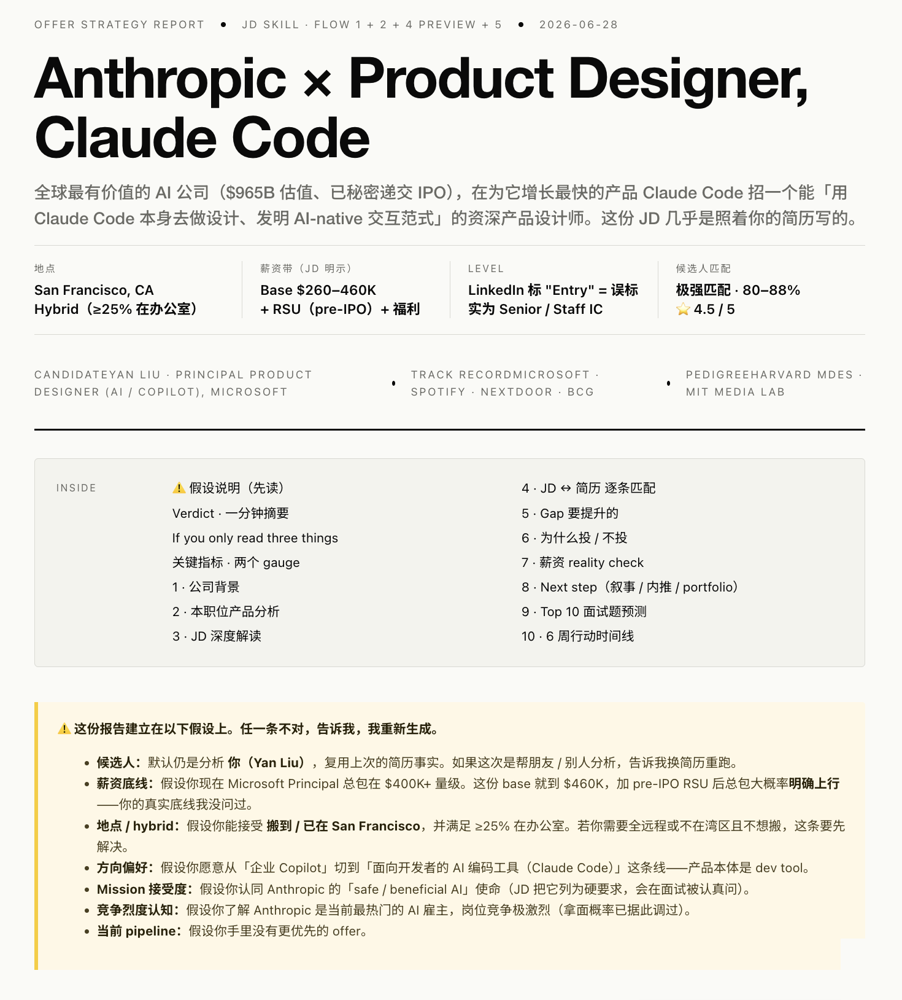
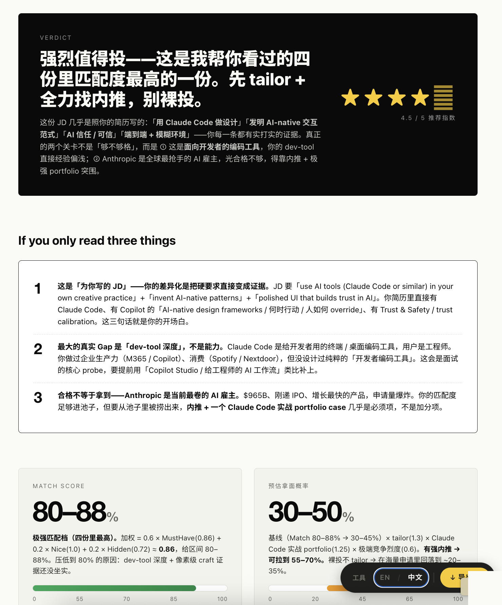
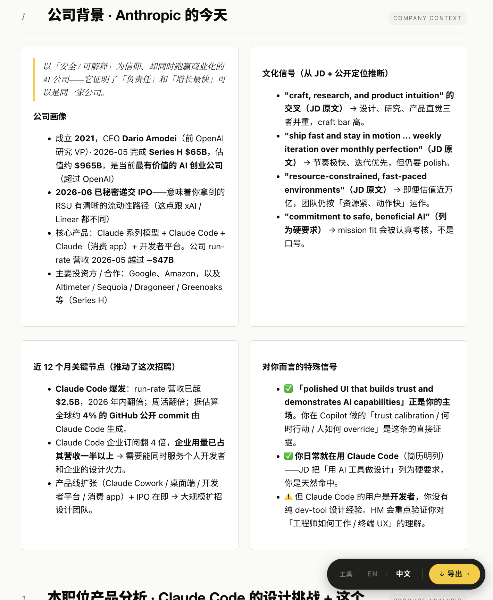
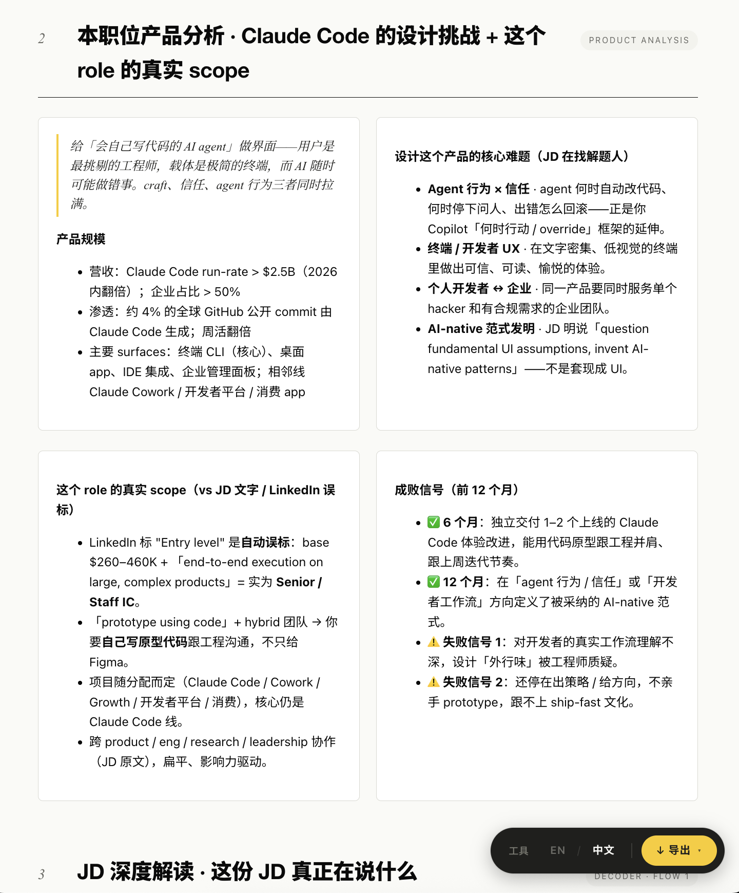
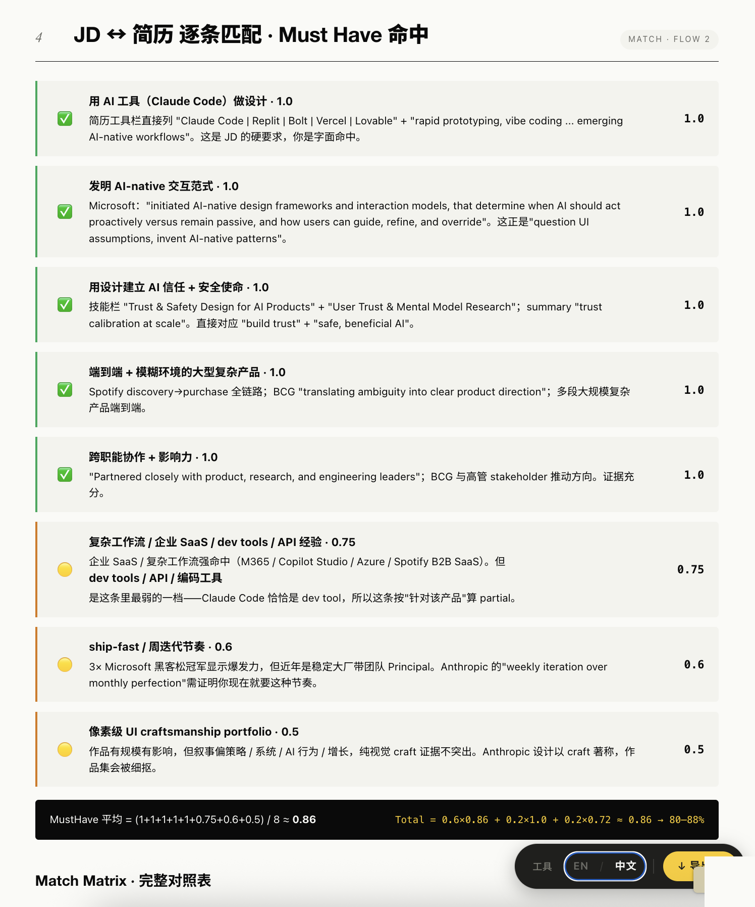
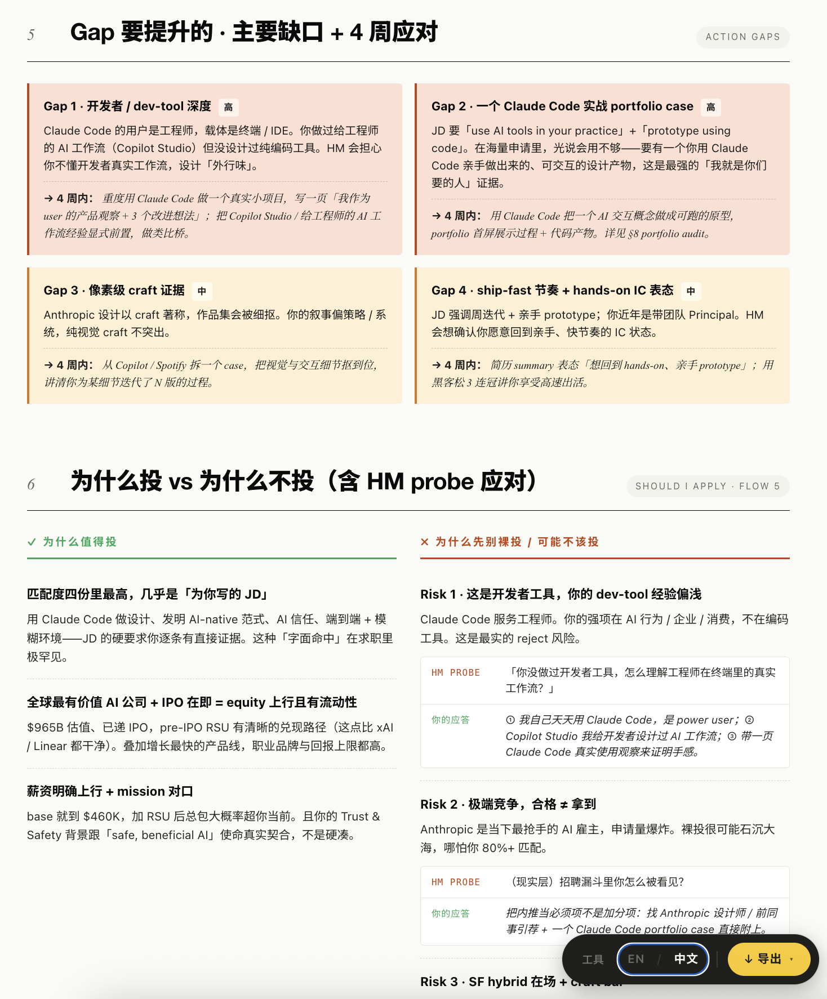
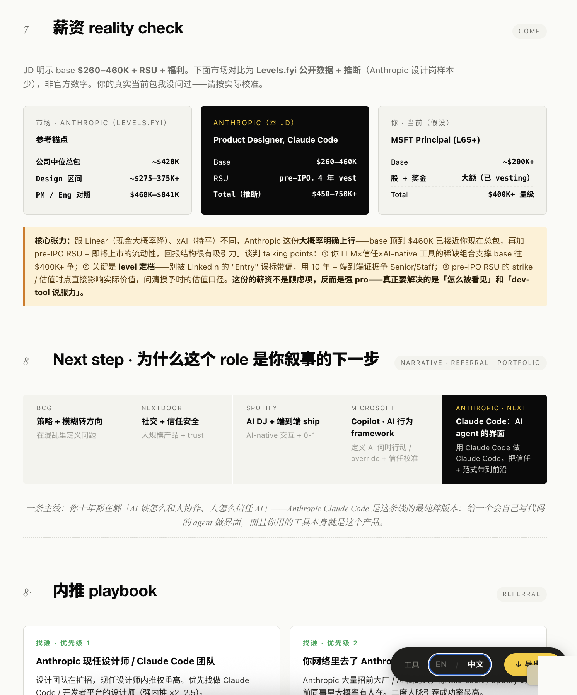
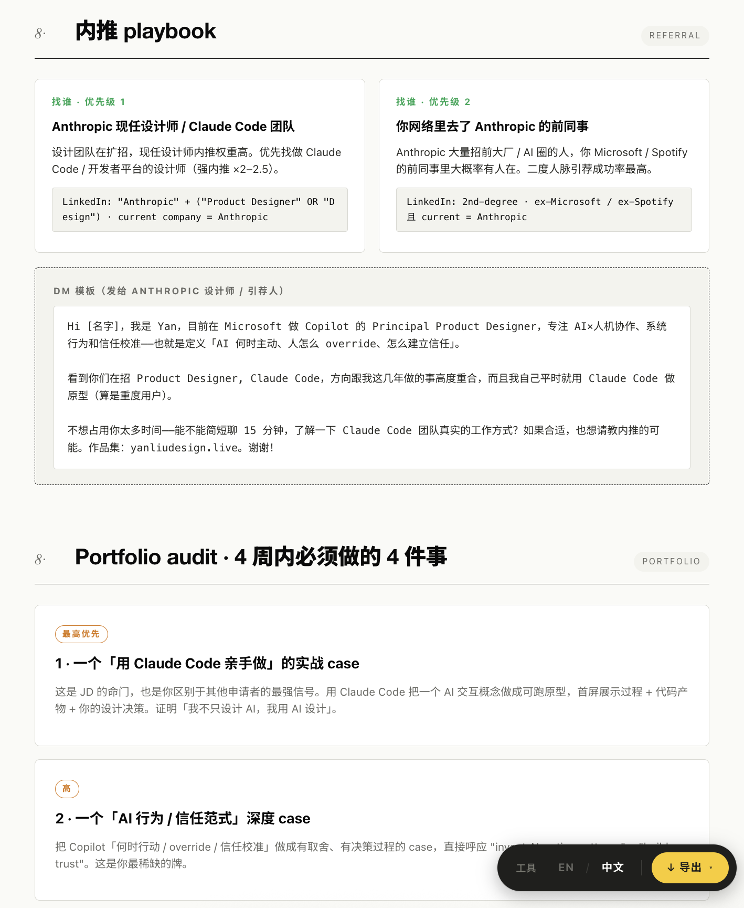
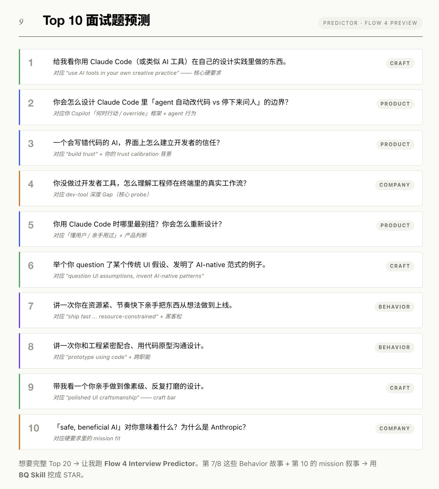
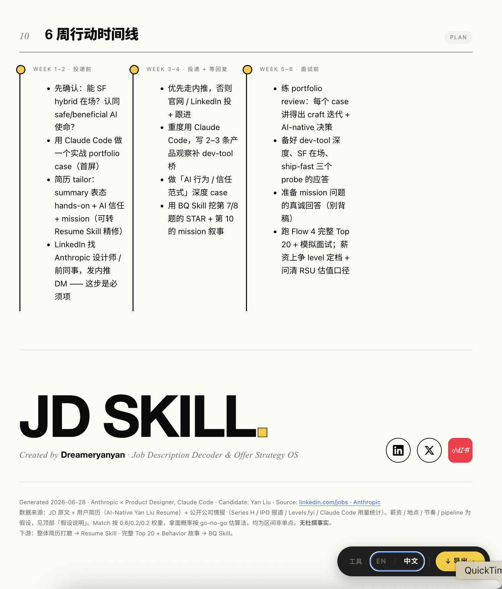

<div align="center">

**中文** · [English](./README.md)

# 🧰 Offer Toolkit

---

**三个求职工具打包成一个 agent skill 包 — JD · Resume · BQ。**

[](./LICENSE)
[]()
[]()
[](https://github.com/yanliudesign/offer-toolkit-skill/stargazers)

[](https://claude.ai/code)
[]()
[]()
[]()
[]()

</div>

三个求职工具打包成一个 agent skill 包。可以整包用，也可以只挑其中一个——每个子目录都能独立跑。

```
看到心动岗位 → job-description-skill   解码 JD、出一份 Offer Strategy 报告
       ↓ 决定投
              resume-skill            改简历、11 套打印级模板
       ↓ 拿到面试
              bq-skill                挖故事、建故事库、准备 BQ
```

## 里面有什么

| 子 skill | 做什么 |
|---|---|
| **[job-description-skill](job-description-skill/)** | 贴一份 JD 和你的简历，给你一份 HTML 报告，告诉你：这岗位到底该不该投、你和它多匹配、差在哪里、面试大概会问什么、薪资合不合理、接下来 6 周该做什么。 |
| **[resume-skill](resume-skill/)** | 帮你把现有简历改好看，或者从 LinkedIn 导入，再或者聊着聊着帮你从零写一份。给你 **11 套打印级模板**（Classic-ATS、Ledger、Tech Compact、Modern Sidebar、Pillar、Elegant Serif、Atelier、Timeline、Swiss、Executive、Color-block）。每次同时给你两份文件：一份直接可以打印成 PDF，一份在浏览器里点字就能改。 |
| **[bq-skill](bq-skill/)** | 不是给你现成答案，而是帮你把过去真实做过的事情挖出来、整理成一个可以反复用的故事库。它会一步步追问你的经历，帮你用 STAR/CAR 理清思路，打上“拿主意”“択历就难”这类标签，中英文各存一份，下次碰上不同行为面试题也能用同一个故事。还能对着一份 JD，预测这家公司会问的 20 道题，帮你逐题准备。 |

## 示例



<sub>由 <code>job-description-skill</code> 生成的 Offer Strategy 报告，在浏览器里打开——Verdict、假设说明、TL;DR，以及右下角内置的 EN / 中文 切换。</sub>

<table>
<tr>
<td width="33%"></td>
<td width="33%"></td>
<td width="33%"></td>
</tr>
<tr>
<td></td>
<td></td>
<td></td>
</tr>
<tr>
<td></td>
<td></td>
<td></td>
</tr>
</table>

<sub>完整相册：<a href="docs/zh/">中文</a> · <a href="docs/en/">English</a> — 各子 skill 的单独相册在各自目录下的 <code>docs/</code> 或 <code>assets/</code>。</sub>

## 三条共用规则

1. **不杜撰。** 所有经历、职责、数字都来自用户真实说过的内容。可以帮改弱表达，但绝不编公司、职位、成果、量化数字。数字都要向用户求证。
2. **一次只问一个问题。** 挖故事、建简历、准备 BQ 都是对话，不是问卷。
3. **先结构化再产出。** 先落到标准数据模型，确认无误再渲染 HTML 或生成答案。

## 安装

把整个 `offer-toolkit-skill/` 目录放进你的 skill 目录（例如 `~/.claude/skills/` 或 VS Code 的 prompts 目录）。三个子 skill 会一起被发现。

只想装一个？把对应子目录（如 `resume-skill/`）单独复制过去，每个都自包含。

## 触发词

| 用户说 | 走哪个 |
|---|---|
| 贴 JD / "这个岗位该不该投" / "帮我看看这份工作" | job-description-skill |
| "帮我美化简历" / "帮我从零做一份" / 上传 PDF / 贴 LinkedIn | resume-skill |
| "帮我准备 behavioral 面试" / "Tell me about a time…" / "帮我挖一个故事" | bq-skill |
| "帮我找工作" / 一次把 JD + 简历都给你 | 顶层 [SKILL.md](SKILL.md) 路由到对的那个 |

## 目录结构

```
offer-toolkit-skill/
├── SKILL.md                        # 路由：意图 → 子 skill
├── README.md / README.zh.md
├── LICENSE                         # MIT
├── job-description-skill/          # ① JD 解码 + Offer Strategy 报告
├── resume-skill/                   # ② 简历生成 + 11 套模板
└── bq-skill/                       # ③ 行为面试 / 故事库
```

每个子目录里都有各自的 `SKILL.md`、README、prompts、frameworks、templates。

## 独立仓库

这三个 skill 也各自有独立仓库，独立维护：

- [job-description-skill](https://github.com/yanliudesign/job-description-skill)
- [resume-builder-skill](https://github.com/yanliudesign/resume-builder-skill)
- [Behavior-question-skill](https://github.com/yanliudesign/Behavior-question-skill)

这个 bundle 只是把它们放到一起，多加一层顶层路由。

## License

MIT 协议 — 随便 fork、改造、发一个你自己的版本。

Created by [Dreameryanyan](https://www.linkedin.com/in/yanliudesign/) ·
[LinkedIn](https://www.linkedin.com/in/yanliudesign/) ·
[X](https://x.com/yanliudreamer) ·
[小红书](https://www.xiaohongshu.com/notification)
