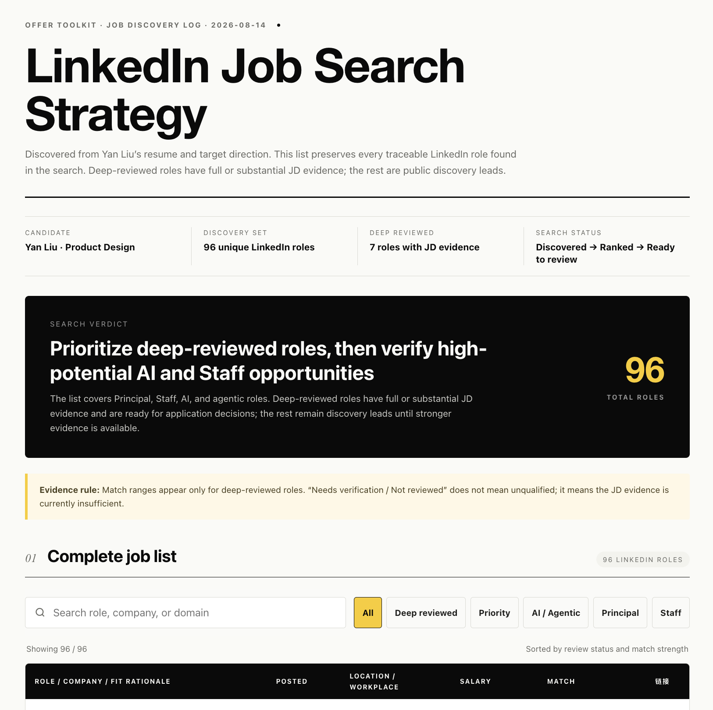
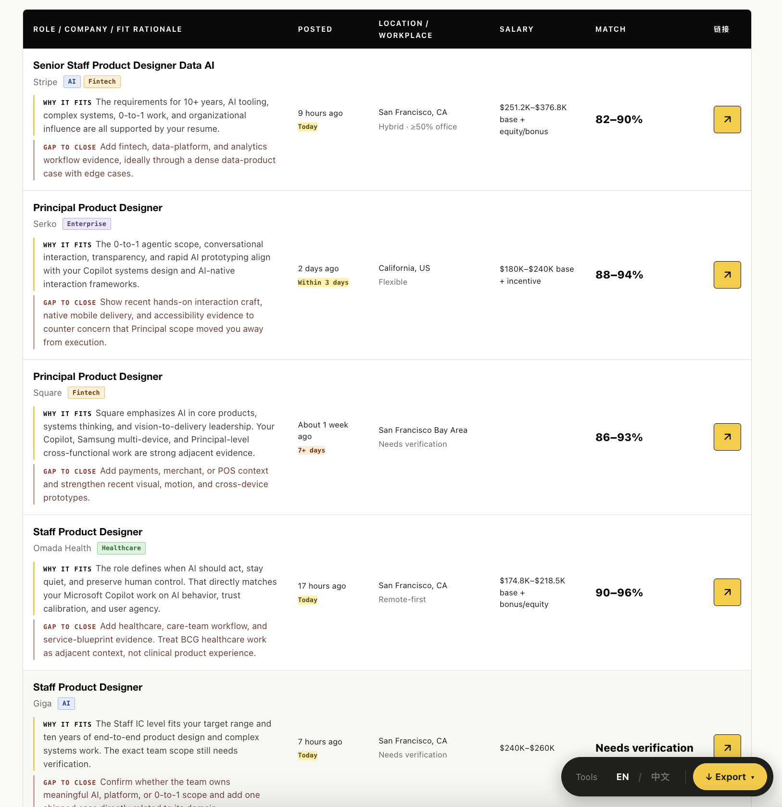
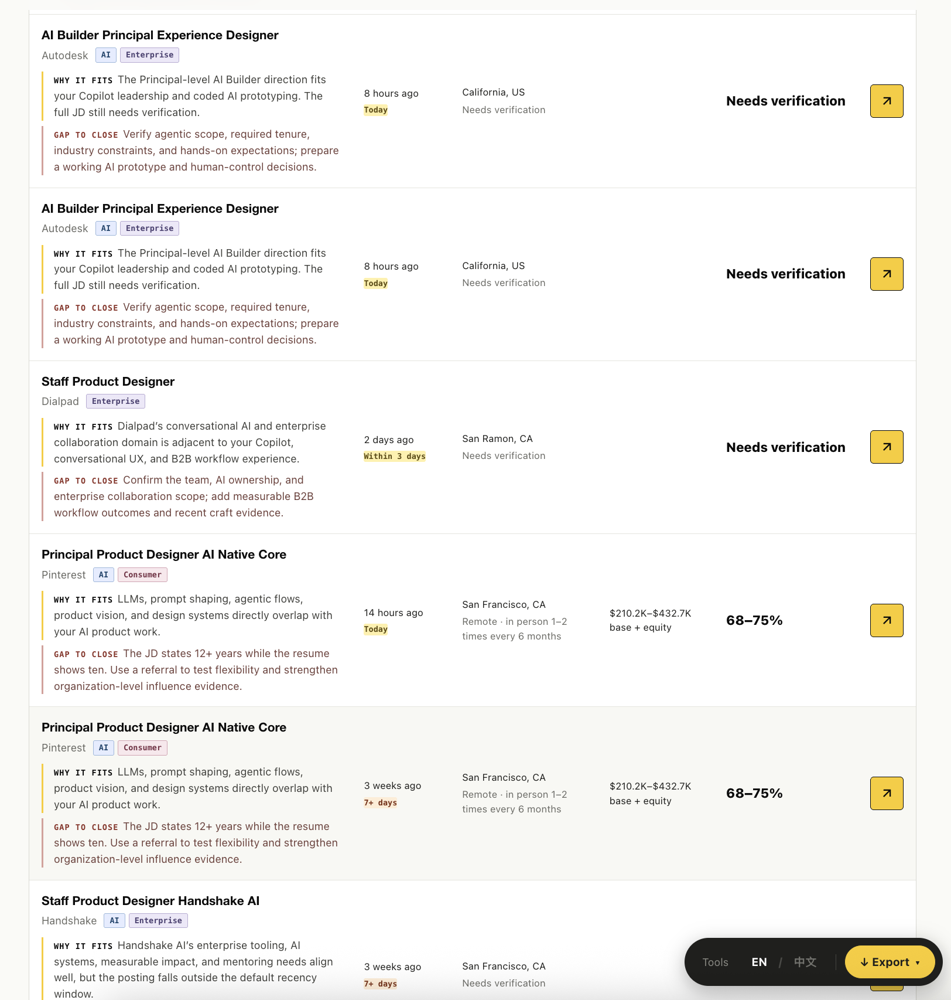
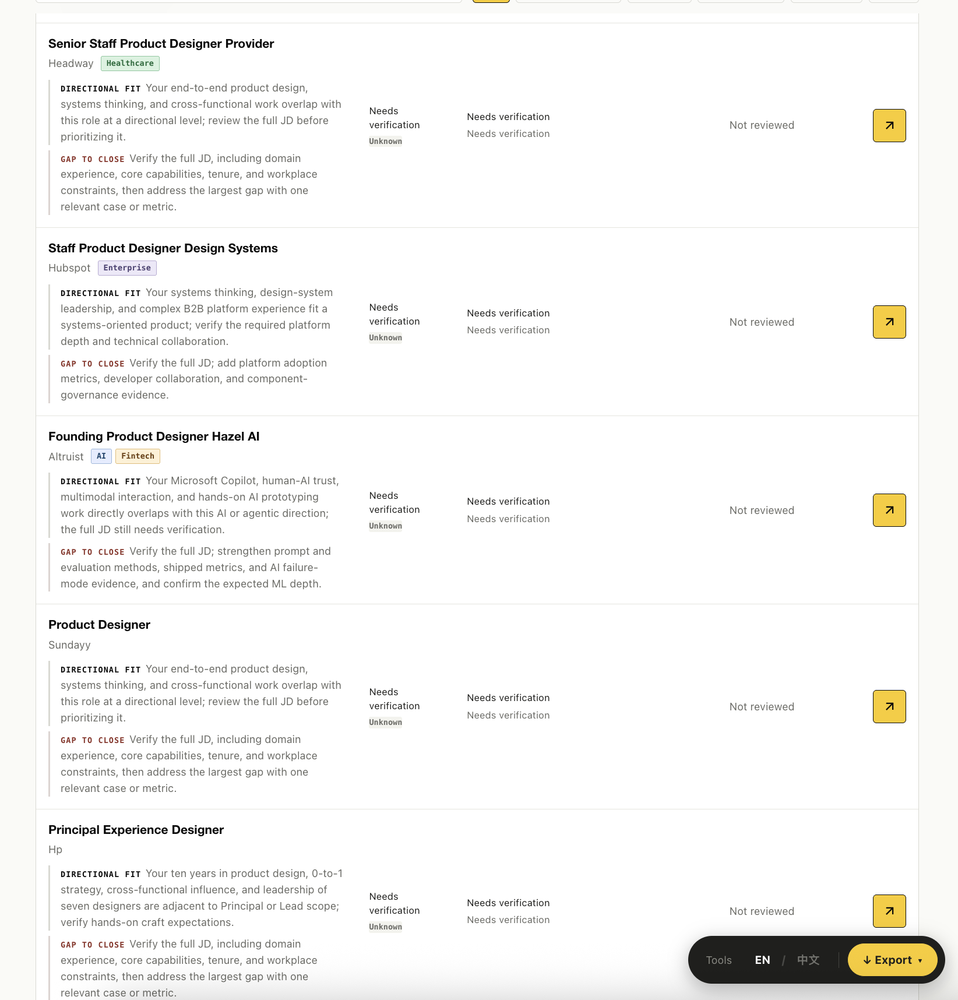
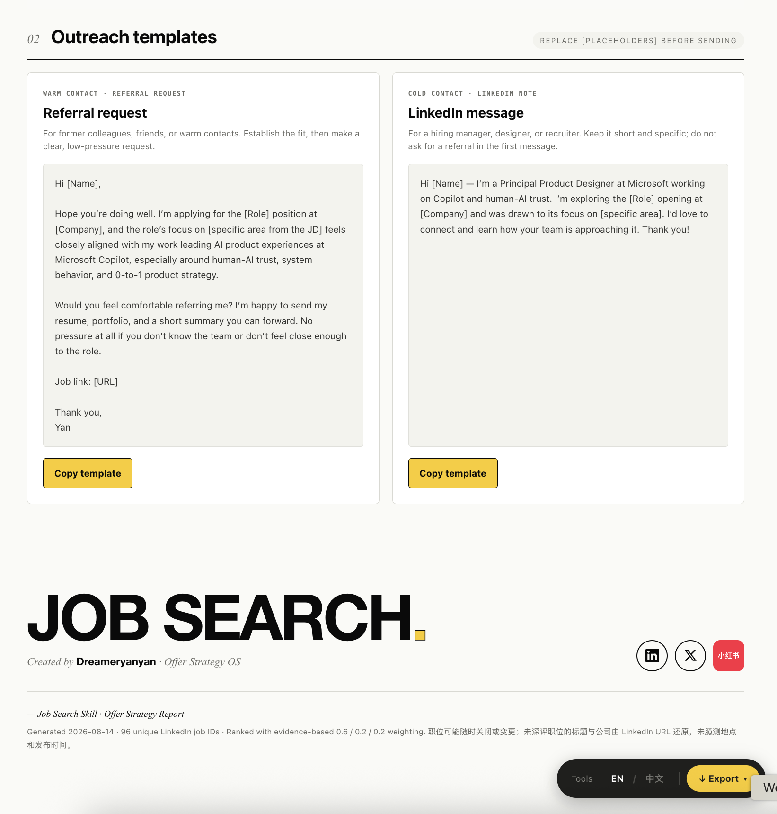

<div align="center">

[中文](./README.zh.md) · **English**

# 🔎 job-hunt-skill

---

**Turn a resume or target direction into a complete, searchable job opportunity list.** Discover · deduplicate · verify · rank · track.

[](https://github.com/yanliudesign/job-hunt-skill/blob/main/LICENSE)
[]()
[]()
[](https://github.com/yanliudesign/job-hunt-skill/stargazers)

[](https://claude.ai/code)
[]()
[]()
[]()
[]()

</div>

> 📦 Part of **[offer-toolkit-skill](https://github.com/yanliudesign/offer-toolkit-skill)** — the complete Search · JD · Resume · BQ · Compare · Negotiate workflow.

An agent skill for turning a resume, target direction, seed JD, or pile of job links into a searchable HTML job database. It searches public sources, removes duplicates, distinguishes verified facts from inference, and keeps the complete qualified pool instead of collapsing everything into a five-role shortlist.

---

## Report preview



<table>
	<tr>
		<td width="50%"></td>
		<td width="50%"></td>
	</tr>
	<tr>
		<td></td>
		<td></td>
	</tr>
</table>

---

## How it works

```text
Resume / target / seed JD
		   ↓
Search profile → query matrix → public candidate pool → deduplication
		   ↓
Evidence grading → match ranking → searchable HTML job-hunt-skill report
```

1. **Provide a starting point** — a resume, target titles, a seed JD, or existing job links.
2. **Confirm hard constraints** — location, workplace mode, level, date range, and exclusions.
3. **Get a searchable report** — every qualified unique role, evidence status, match rationale, gaps, and direct links in one HTML file.

## What it does

- Builds a focused search profile and complementary query matrix
- Searches LinkedIn, company career pages, and other public sources
- Deduplicates by canonical job ID and URL
- Separates verified facts, partial evidence, inference, and unknowns
- Deep-scores only roles with enough visible JD evidence
- Keeps the complete qualified pool instead of returning an arbitrary shortlist
- Generates a self-contained HTML report with search, filters, domain tags, reasons, gaps, and direct job links
- Updates an existing list while preserving first-seen history

## Boundaries

- Never applies for jobs, fills forms, sends messages, or acts as the user
- Never asks for passwords, verification codes, cookies, or session tokens
- Never bypasses login walls, CAPTCHAs, rate limits, or robots restrictions
- Never invents salary, posted date, workplace policy, visa policy, or JD requirements

## Trigger examples

- “Use job-hunt-skill to build a searchable report from my resume.”
- “Find matching Principal Product Designer roles and make a searchable report.”
- “Turn these LinkedIn links into a deduplicated job tracker.”
- “Update last week’s job list with newly posted AI design roles.”

## Install

Copy the entire `job-hunt-skill/` directory into your agent skills directory. The folder is self-contained and does not require the rest of Offer Toolkit.

## Repository structure

```text
job-hunt-skill/
├── SKILL.md                     # Workflow, boundaries, and output contract
├── README.md / README.zh.md    # English and Chinese documentation
├── examples/
│   ├── en/                     # English report screenshots
│   └── cn/                     # Chinese report screenshots
├── assets/
│   └── report-spec.md          # Searchable HTML report specification
├── references/
│   └── evidence-ranking.md     # Evidence and ranking rules
└── evals/
	└── evals.json              # Trigger and behavior evaluations
```

## Related skills

- [offer-toolkit-skill](https://github.com/yanliudesign/offer-toolkit-skill) — complete Search · JD · Resume · BQ · Compare · Negotiate bundle
- [job-description-skill](https://github.com/yanliudesign/job-description-skill) — deep analysis for a selected role
- [resume-builder-skill](https://github.com/yanliudesign/resume-builder-skill) — resume generation and beautification
- [Behavior-question-skill](https://github.com/yanliudesign/Behavior-question-skill) — behavioral interview preparation and story bank

## License

MIT — fork it, remix it, ship your own version.

Created by [Dreameryanyan](https://www.linkedin.com/in/yanliudesign/) ·
[LinkedIn](https://www.linkedin.com/in/yanliudesign/) ·
[X](https://x.com/yanliudreamer) ·
[Xiaohongshu](https://www.xiaohongshu.com/notification)
